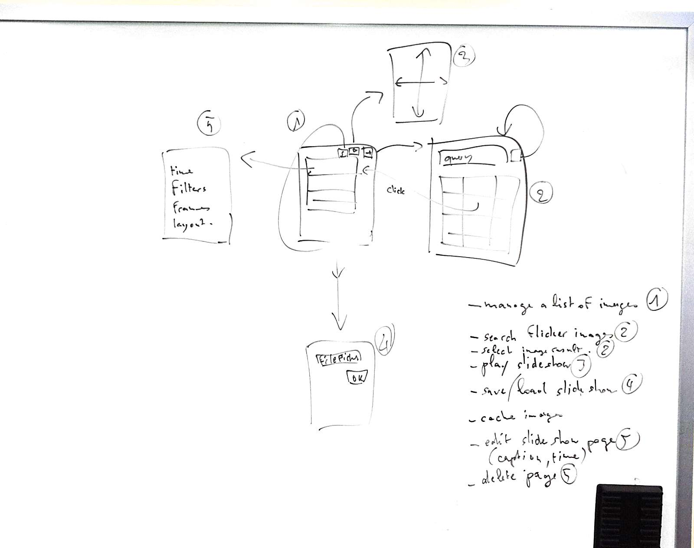

FlickrApp
=========

Flickr Slideshow App

We will be creating an application to build and play slideshows from flickr images.

**Stories:**
 - Display a list of images
 - Search flicker public images and view results
 - Select image from flickr results and add it to the list
 - Play list of images as a slide show
 - Save/Load a slideshow
 - Configure a slideshow page (page duration, caption, ...)
 - Delete a page
 - (Optionnal) Cache images
 - (Optionnal) Apply simple image filters (black and white, ...)
 - (Optionnal) Apply simple image overlay (frames, text, basic shapes, ...)
 - (Optionnal) Save slideshow as a single file (archive?, svg?)
 - (Optionnal) Add option to share slideshow
 - (Optionnal) Current location based flickr search option
 - (Optionnal) Popularity? based flickr search option
 - (Optionnal) timeline based flickr search option

